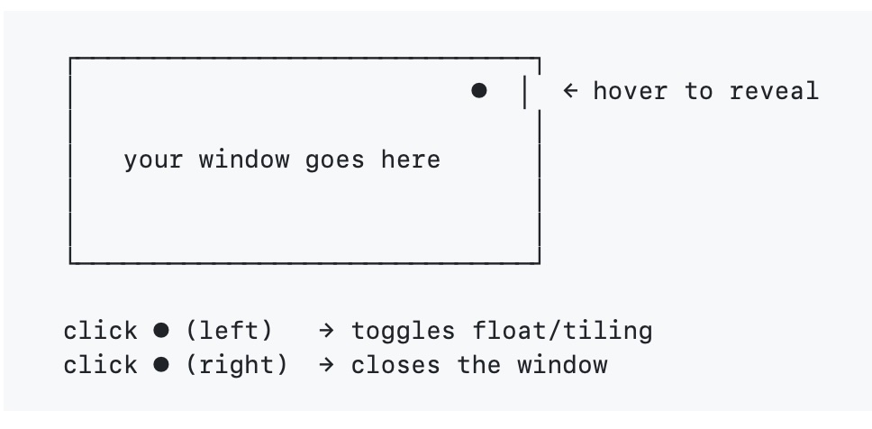

# thetinybuttons

One tiny button on every window corner. Toggles float and closes.

An [Omarchy](https://omarchy.org) shell plugin.

## What it does

Hover a window's top-right corner and a small solid circle appears. It does three things:

| Action | Result |
|--------|--------|
| Left-click (primary) or 1-finger tap | Toggle between tiling and float mode |
| Right-click or 2-finger tap | Close the window |
| 3-finger tap | Enter drag mode: the window is floated, the pointer moves to its center, and the window follows the cursor; tap anywhere to release it |

In drag mode the window behaves like Hyprland's SUPER+drag, but without holding SUPER: the currently controlled window is **floated** (whatever its previous state), the pointer is warped to the window's center, and a full-screen overlay polls `hyprctl cursorpos` to track the pointer while you move the mouse. The next tap (any button) releases the window where it is — it stays floating until you toggle it back.

## See it in action



```
  click ● (left)   → toggles float/tiling
  click ● (right)  → closes the window
  3-finger tap ●   → floats the window, centers the pointer, drag, tap to release
```

## Install

```
omarchy plugin add https://github.com/nagualcode/omarchy-thetinybuttons.git --enable
```

## Uninstall

```
omarchy plugin remove nagualcode.thetinybuttons
```

## How it works

- A small layer-shell panel sits on each window's top-right corner, projected from the window's global coordinates
- The button is a solid circle filled with the window border color (active or inactive)
- The button spans exactly one touch target so it works with both mouse and touchpad
- A 3-finger tap on the button enters drag mode: a full-screen overlay polls `hyprctl cursorpos` to track the pointer, the window is floated (if it was not already) and moved via `hl.dsp.window.move` (relative), and the pointer is warped to the window's center so the drag is as precise as SUPER+drag; the next tap anywhere releases it. The window stays floating
- Windows are polled every 400ms (80ms while dragging) so the button stays glued while windows move or resize

## Dependencies

No external dependencies. Just Hyprland and Quickshell (both ship with Omarchy).

## License

MIT
