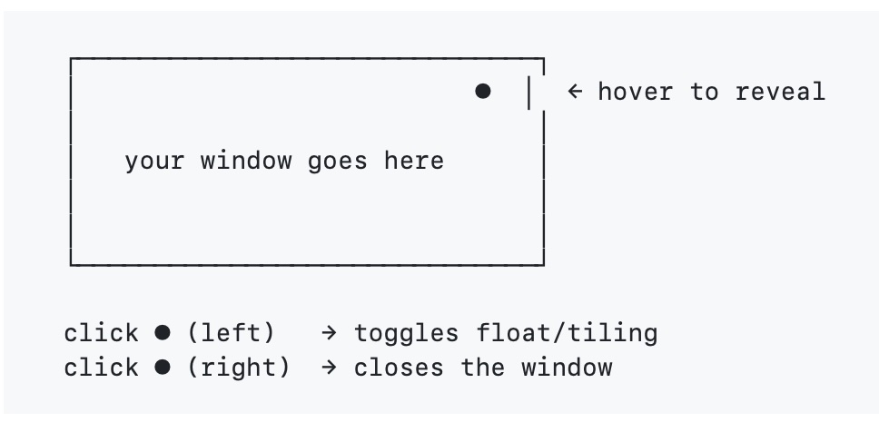

# thetinybuttons

Tiny direction arrows at the middle of each edge of the focused tiled window (moves the tile toward that edge) — and a set of window-control buttons drawn over the titlebar, whose glyphs reflect the current window state (tiled vs. floating, maximized or not).

An [Omarchy](https://omarchy.org) shell plugin.

## What it does

### Titlebar window controls

The [hyprbars](https://github.com/hyprland-community/hyprbars) plugin can only render static glyphs, so the titlebar controls are drawn here as an **overlay** over the bar, revealed while the pointer is on it. They are pure geometric shapes (no font/emoji) and swap by the window's live state:

| Button | Glyph | Action |
|--------|-------|--------|
| Close | filled circle `●` | Close the window |
| Float/tiling | `■` filled square while **floating**, hollow `□` square while **tiled** | Toggle tiling/float |
| Maximize | `▲` triangle up while normal, inverted `▼` while maximized | Toggle maximize/restore |

The buttons sit over the top-left of the titlebar (where the hyprbars buttons used to be) and are colored like the window border — accent when focused, muted border color when not. Titles bars are colored by the theme accent and reapplied from `hyprbars.lua`.

A legacy solid circle also used to sit on every window's top-right corner (float/close/drag); that corner button is **disabled by default** — set `cornerButtonEnabled` to `true` in `Service.qml` to bring it back:

| (legacy) corner button | Result |
|------------------------|--------|
| Left-click (primary) or 1-finger tap | Toggle between tiling and float mode |
| Right-click or 2-finger tap | Close the window |
| 3-finger tap | Enter drag mode: the window is floated, the pointer moves to its center, and the window follows the cursor; tap anywhere to release it |

In drag mode the window behaves like Hyprland's SUPER+drag, but without holding SUPER: the currently controlled window is **floated** (whatever its previous state), the pointer is warped to the window's center, and a full-screen overlay polls `hyprctl cursorpos` to track the pointer while you move the mouse. The next tap (any button) releases the window where it is — it stays floating until you toggle it back.

### Edge buttons (focused tiled windows only)

The **focused** tiled window gets a small arrow at the middle of each edge, pointing toward that edge (`←` left, `→` right, `↑` up, `↓` down), in the same color as the corner button. Each arrow sits just inside the window, its tip against the window's edge, and it only appears while the pointer is near that edge. Clicking an arrow moves the window one tiling step in that direction — the same as `SUPER+SHIFT+arrow`.

Arrows only appear when they can actually do something:

- only on the **focused** window, and only while it is **tiled** (never in float or fullscreen);
- only when there is **more than one tiled window** on the workspace (a lone tile has nothing to swap with);
- an edge flush with the **tiling layout** hides its arrow — the window is already at the last slot in that direction, so it cannot be moved any further out. The comparison uses the layout's own bounding box (first/last row and column of tiled windows), not the screen border, so it stays correct under top/bottom reserved strips (e.g. a panel at the top or the speakercorners strip at the bottom), window gaps and asymmetric mosaics. A window in the topmost row never shows the up arrow, and so on.

## See it in action



```
  click ← → ↑ ↓ (an edge arrow) → moves the focused tiled window one step toward that edge
```

## Install

```
omarchy plugin add https://github.com/nagualcode/omarchy-thetinybuttons.git --enable
```

## Uninstall

```
omarchy plugin remove nagualcode.thetinybuttons
```

## How it works

- A small layer-shell panel per edge is created only for **tiled** windows and only while that window is **focused**; it draws a small arrow at the middle of the edge in the same color as the corner button, aligned just **inside** the window so its tip touches the edge. An edge's arrow is revealed only while the pointer is within a band around that edge (`hyprctl cursorpos` is polled every 150ms) **and** that edge can still move — it stays hidden when the edge is flush against the **tiling layout** (the bounding box of all tiled windows on the workspace, so top/bottom reserved strips, gaps and asymmetric mosaics are handled correctly), when fewer than two tiled windows share the workspace, or when the window floats or is fullscreen. `hl.dsp.window.swap` acts on the focused window only, so the target is focused first (no cursor warp) and swapped via the same dispatch as `SUPER+SHIFT+arrow`
- A one-layer-shell panel **per window** draws the three titlebar controls (circle / square / triangle) as an overlay over the hyprbars bar, at the window's top-left. The square and triangle glyphs are re-bound to the window's IPC state (`floating`, `fullscreen`), so they swap automatically; the panels are polled every 400ms so they stay glued and current. Clicks dispatch `hl.dsp.window.close`, `hl.dsp.window.float` and `hl.dsp.window.fullscreen` targeted by window address
- The legacy top-right corner button and its drag mode are still compiled in but disabled via `cornerButtonEnabled` (default `false`): float/close now live in this plugin's titlebar controls (the native hyprbars buttons are removed)
- In this Omarchy build `Hyprland.activeToplevel` is always null and the `activewindow` raw event carries no address, so the focused window is tracked by re-reading `hyprctl activewindow` whenever focus changes
- When the legacy corner button is enabled: the button is a solid circle filled with the window border color (active or inactive), spans exactly one touch target so it works with both mouse and touchpad, and a 3-finger tap on it enters drag mode: a full-screen overlay polls `hyprctl cursorpos` to track the pointer, the window is floated (if it was not already) and moved via `hl.dsp.window.move` (relative), and the pointer is warped to the window's center so the drag is as precise as SUPER+drag; the next tap anywhere releases it. The window stays floating
- Windows are polled every 400ms (80ms while dragging) so the buttons stay glued while windows move or resize

## Dependencies

No external dependencies. Just Hyprland and Quickshell (both ship with Omarchy).

## License

MIT
